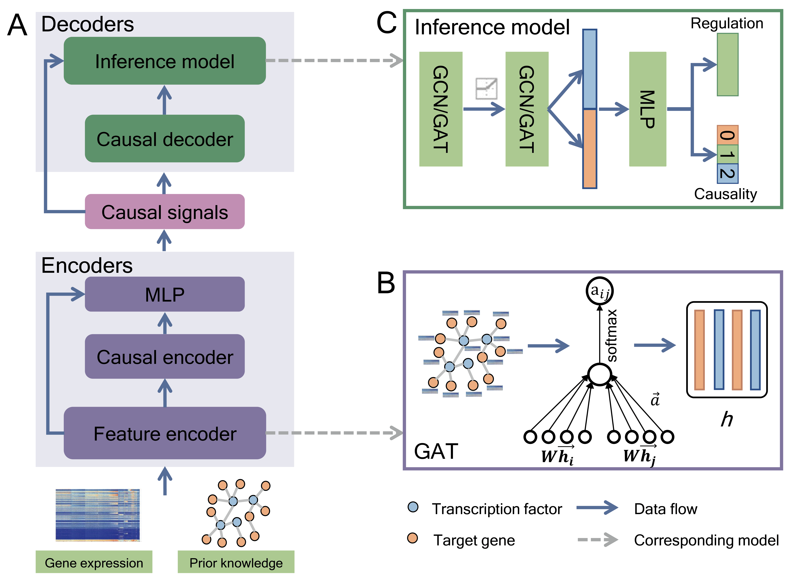

# GRACE: Unveiling Gene Regulatory Networks with Causal Mechanistic Graph Neural Networks in single-cell RNA-sequencing Data
A causall mechanistic approach that integrating structural causal model and graph neural network model for unveiling gene regulatory network from single-cell RNA-sequencing data</br>
</br>
</br>
GRACE is a graph-based causal autoencoder framework that takes gene expression and an adjacent matrix representing the prior regulatory graph as input. It aims to infer gene regulatory (or causal) relationships and produces an inference result. The feature encoder module utilizes a graph attention network (GAT) to capture low-dimensional representations of transcription factors (TFs) and target genes. It achieves this by assigning different weights to different nodes in the graph, enabling the identification of important features. The inference model architecture of GRACE consists of two stacked Graph Convolutional or Graph Attentional (GAT) layers. These layers learn feature embeddings for TFs and target genes. The resulting embeddings are concatenated to form representation vectors for gene pairs. The MLP layer in the architecture allows for both gene regulatory inference and causal inference. By adapting the number of neurons in the output layer, GRACE can flexibly handle different inference tasks. For example, setting the number of neurons to 1 can focus on gene regulatory inference, while setting it to 3 can enable causal inference.</br>
## Dependencies
dgl >=0.9</br>
networkx >=2.6</br>
numpy >=1.20</br>
pandas >=1.3</br>
python >=3.7</br>
pytorch >=1.11</br>
scikit-learn >=1.0</br>

## Usage
We provided an example dataset under example/mESC/ for running gene regulatory (or causal) inference using GRACE. It takes gene expression (**N✖M**) and an adjacent matrix (**M✖M**) representing the prior regulatory graph as input.
* For **normal data separation**, run `python train.py`</br>
+ For **strict data separation**, run `python train_HardTrainTest.py`</br>
* The hyperparameters of GRACE can be modified in **param.yaml** file. To apply causal inference, just set flag as **True**.

## Citing
If you find our paper and code useful, please consider citing the [paper](https://ieeexplore.ieee.org/document/10562353):
```
@article{GRACE,
  title={GRACE: Unveiling Gene Regulatory Networks With Causal Mechanistic Graph Neural Networks in Single-Cell RNA-Sequencing Data},
  author={Jiacheng, Wang and Yaojia, Chen and Quan, Zou},
  journal={IEEE Transactions on Neural Networks and Learning Systems},
  doi = {10.1109/TNNLS.2024.3412753},
  year={2024},
}
```
